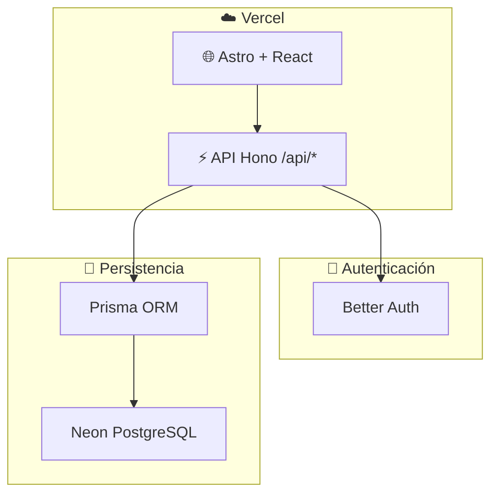

<div align="center">

# 🍽️ SmartMenu

### Menús digitales modernos para restaurantes, cafés y bares

Plataforma SaaS para **crear, administrar y publicar** cartas digitales con actualización en tiempo real.

[](https://astro.build)
[](https://react.dev)
[](https://www.typescriptlang.org)
[](https://hono.dev)
[](https://www.prisma.io)
[](https://neon.tech)
[](https://vercel.com)

[Demo visual](#-demo) · [Inicio rápido](#-inicio-rápido) · [Documentación](#-documentación) · [Roadmap](#-estado-del-proyecto)

</div>

---

## ✨ ¿Qué es SmartMenu?

SmartMenu permite que negocios gastronómicos gestionen su carta desde un **panel de administración** y la publiquen en una **URL pública** accesible desde cualquier dispositivo.

| Para el negocio | Para el comensal |
| :--- | :--- |
| 📝 Editar menú sin tocar código | 📱 Menú responsive y rápido |
| 🎨 Personalizar la apariencia | 🔍 Navegación clara por categorías |
| 👥 Roles Owner / Staff | ⚡ Carga optimizada (SEO + rendimiento) |
| 🔗 URL única por restaurante | 🌙 Temas visuales adaptables |

---

## 🚀 Demo

Visita la **vista de ejemplo** con datos mock y tres presets visuales intercambiables:

```
http://localhost:4321/example
```

| Tema | Estilo | Ideal para |
| :--- | :--- | :--- |
| `minimal-clean` | Neutro y limpio | Restaurantes, cafés |
| `warm-natural` | Cálido y orgánico | Panaderías, brunch |
| `bold-night` | Oscuro y premium | Bares, burgers |

---

## 🏗️ Arquitectura



---

## 🛠️ Stack tecnológico

| Capa | Tecnologías |
| :--- | :--- |
| **Frontend** | Astro 6, React 19, TypeScript, SCSS Modules, Lucide React |
| **Backend** | Hono, Better Auth, Zod, Prisma 7 |
| **Base de datos** | Neon PostgreSQL |
| **Hosting** | Vercel (serverless) |
| **Testing** | Vitest |
| **Paquetes** | pnpm |

---

## 📁 Estructura del proyecto

```text
Menu-Smart/
├── prisma/                  # Esquema y migraciones
├── src/
│   ├── components/          # UI React (menú de ejemplo, admin futuro)
│   ├── lib/                 # Datos y utilidades del frontend
│   ├── pages/
│   │   ├── api/[...path].ts # Entry point de la API Hono
│   │   ├── example.astro    # Demo visual del menú público
│   │   └── index.astro
│   ├── server/              # API: rutas, middleware, servicios, tests
│   ├── styles/              # Tokens y temas SCSS
│   └── test/                # Setup global de Vitest
└── docs/                    # PRD, backend, diseño, endpoints
```

---

## ⚡ Inicio rápido

### Requisitos

- **Node.js** ≥ 22.12
- **pnpm**
- Base de datos **Neon PostgreSQL** (local o remota)

### Instalación

```bash
# Clonar el repositorio
git clone https://github.com/tu-usuario/Menu-Smart.git
cd Menu-Smart

# Instalar dependencias
pnpm install

# Configurar variables de entorno (crear .env en la raíz)
# DATABASE_URL, DATABASE_URL_TEST, BETTER_AUTH_SECRET, etc.

# Aplicar migraciones
pnpm db:migrate

# Arrancar en desarrollo
pnpm dev
```

La app estará disponible en **http://localhost:4321**

---

## 🧞 Comandos

| Comando | Descripción |
| :--- | :--- |
| `pnpm dev` | 🟢 Servidor de desarrollo |
| `pnpm build` | 📦 Build de producción (`prisma generate` + Astro) |
| `pnpm preview` | 👀 Vista previa del build |
| `pnpm db:migrate` | 🗄️ Migraciones en desarrollo |
| `pnpm db:deploy` | 🚀 Migraciones en producción |
| `pnpm db:studio` | 🔎 Prisma Studio |
| `pnpm test` | 🧪 Vitest en modo watch |
| `pnpm test:run` | ✅ Suite de tests (una ejecución) |

---

## 📡 API (resumen)

Base URL: `/api`

| Endpoint | Estado | Descripción |
| :--- | :---: | :--- |
| `GET /api/health` | ✅ | Health check |
| `/api/auth/*` | ✅ | Autenticación (Better Auth) |
| `/api/restaurants/*` | ✅ | CRUD de restaurantes + RBAC |
| Menús, categorías, productos | 🚧 | Fase 1 en curso |

> Detalle completo de contratos y ejemplos: [`docs/ENDPOINTS-FRONTEND.md`](docs/ENDPOINTS-FRONTEND.md)

---

## 📚 Documentación

| Documento | Contenido |
| :--- | :--- |
| [`docs/PRD.md`](docs/PRD.md) | Visión del producto y requisitos |
| [`docs/BACKEND-IMPLEMENTATION.md`](docs/BACKEND-IMPLEMENTATION.md) | Plan de implementación del backend por fases |
| [`docs/ENDPOINTS-FRONTEND.md`](docs/ENDPOINTS-FRONTEND.md) | Contrato API para consumo desde el frontend |
| [`docs/design.md`](docs/design.md) | Design system del menú de ejemplo |

---

## 🗺️ Estado del proyecto

| Fase | Alcance | Estado |
| :--- | :--- | :---: |
| **0** | Fundamentos: Prisma, Hono, health check, tests | ✅ |
| **1** | MVP: auth, restaurantes, menús, productos | 🔄 En curso |
| **2** | Personalización y organización | ⏳ |
| **3** | SaaS multi-tenant y analytics | ⏳ |
| **4** | Internacionalización | ⏳ |

---

## 🤝 Contribuir

1. Haz fork del repositorio
2. Crea una rama: `git checkout -b feature/mi-mejora`
3. Commit con mensajes claros
4. Abre un Pull Request

---

<div align="center">

**Desarrollado por [GRGSolutions](https://github.com)**

⭐ Si te resulta útil, ¡dale una estrella al repo!

</div>
