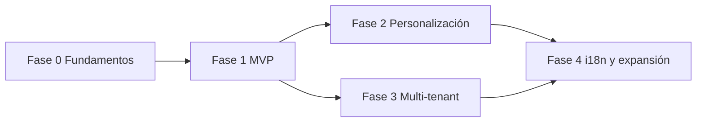

# SmartMenu — Fases de Implementación del Backend

| Campo      | Valor                                          |
| ---------- | ---------------------------------------------- |
| Versión    | 1.4                                            |
| Estado     | Fase 0 completada · Fase 1 en curso (§6.2 auth) |
| Referencia | [PRD.md](./PRD.md) v1.3                        |
| Alcance    | API Hono, Prisma, Better Auth, Neon PostgreSQL |
| Owner      | GRGSolutions                                   |

---

## Tabla de contenidos

1. [Propósito del documento](#1-propósito-del-documento)
2. [Estado actual](#2-estado-actual)
3. [Arquitectura del backend](#3-arquitectura-del-backend)
4. [Estructura de carpetas propuesta](#4-estructura-de-carpetas-propuesta)
5. [Fase 0 — Fundamentos](#5-fase-0--fundamentos)
6. [Fase 1 — MVP (Backend)](#6-fase-1--mvp-backend)
7. [Fase 2 — Personalización y organización](#7-fase-2--personalización-y-organización)
8. [Fase 3 — SaaS multi-tenant y analytics](#8-fase-3--saas-multi-tenant-y-analytics)
9. [Fase 4 — Internacionalización y expansión](#9-fase-4--internacionalización-y-expansión)
10. [Matriz de autorización](#10-matriz-de-autorización)
11. [Catálogo de endpoints por fase](#11-catálogo-de-endpoints-por-fase)
12. [Variables de entorno](#12-variables-de-entorno)
13. [Requisitos no funcionales (backend)](#13-requisitos-no-funcionales-backend)
14. [Estrategia de pruebas](#14-estrategia-de-pruebas)
15. [Despliegue y CI/CD](#15-despliegue-y-cicd)
16. [Criterios de aceptación por fase](#16-criterios-de-aceptación-por-fase)
17. [Dependencias entre fases](#17-dependencias-entre-fases)
18. [Riesgos y mitigaciones](#18-riesgos-y-mitigaciones)

---

## 1. Propósito del documento

Este documento traduce la visión del [PRD](./PRD.md) en un plan de implementación **exclusivo del backend**: API REST con Hono, persistencia con Prisma sobre Neon PostgreSQL, autenticación con Better Auth y validación con Zod.

Cada fase define:

- Objetivos concretos del backend.
- Entregables técnicos.
- Tareas ordenadas por dependencia.
- Endpoints y modelos involucrados.
- Criterios de aceptación verificables.

El frontend (Astro + React) consume esta API; las fases aquí descritas no incluyen UI salvo donde sea necesario para integración (p. ej. cookies de sesión, CORS).

---

## 2. Estado actual

Actualizado tras cierre de **Fase 0** (2026-06-10):

| Componente               | Estado                                                                 |
| ------------------------ | ---------------------------------------------------------------------- |
| Neon PostgreSQL          | Provisionado; migración inicial aplicada; rama **Test** permanente para pruebas |
| Esquema Prisma           | Dominio + Better Auth en `prisma/schema.prisma`                        |
| Cliente Prisma           | Singleton con `@prisma/adapter-pg` en `src/server/lib/prisma.ts`       |
| API Hono                 | Montada en `/api/*` vía `src/pages/api/[...path].ts`                   |
| Health check             | `GET /api/health` operativo                                            |
| Utilidades transversales | `errors.ts`, `response.ts`, `env.ts`                                   |
| Vitest                   | Health + auth en verde; `setup.ts` usa `DATABASE_URL_TEST`             |
| `.env.example`           | Documentado (incluye `DATABASE_URL_TEST`)                              |
| Better Auth              | Operativo en `/api/auth/*`; `requireAuth` y rate limit auth (§6.2)     |
| Zod / validación         | Dependencias instaladas; schemas pendientes (Fase 1)                   |

**Punto de partida:** Fase 1 — MVP (Backend).

---

## 3. Arquitectura del backend

```text
┌─────────────────────────────────────────────────────────┐
│                    Astro (Vercel)                        │
│  ┌──────────────┐    ┌──────────────────────────────┐   │
│  │ Public Menu  │    │ Admin Dashboard (React)      │   │
│  └──────┬───────┘    └──────────────┬───────────────┘   │
│         │                           │                    │
│         └───────────┬───────────────┘                    │
│                     ▼                                    │
│              /api/* (Hono handler)                       │
└─────────────────────┬───────────────────────────────────┘
                      │
         ┌────────────┼────────────┐
         ▼            ▼            ▼
   Better Auth   Middleware    Route Handlers
   /api/auth/*   (auth, RBAC,   (restaurants,
                 validation)    menus, items…)
                      │
                      ▼
                 Prisma Client
                      │
                      ▼
              Neon PostgreSQL
```

### Principios de diseño

| Principio                  | Implementación                                               |
| -------------------------- | ------------------------------------------------------------ |
| Tipado end-to-end          | TypeScript estricto; tipos derivados de Prisma y Zod         |
| Separación de capas        | Routes → Services → Repositories (Prisma)                    |
| Autorización en API        | Roles de negocio en `UserRestaurant`; middleware Hono        |
| Respuestas uniformes       | Envelope `{ success, data }` / `{ success, error }`          |
| Idempotencia donde aplique | Slugs únicos; validación antes de escritura                  |
| Serverless-ready           | Sin estado en memoria; conexión Prisma compatible con Vercel |

---

## 4. Estructura de carpetas propuesta

```text
src/
├── server/
│   ├── index.ts                 # App Hono principal
│   ├── lib/
│   │   ├── prisma.ts            # Cliente Prisma singleton
│   │   ├── auth.ts              # Configuración Better Auth
│   │   └── errors.ts            # Errores tipados y mapeo HTTP
│   ├── middleware/
│   │   ├── auth.ts              # Verificación de sesión
│   │   ├── rbac.ts              # Owner / Staff
│   │   ├── validate.ts          # Wrapper Zod
│   │   └── rate-limit.ts        # Fase 1 tardía o Fase 2
│   ├── routes/
│   │   ├── auth.ts              # Montaje Better Auth
│   │   ├── restaurants.ts
│   │   ├── menus.ts
│   │   ├── categories.ts
│   │   ├── items.ts
│   │   ├── themes.ts
│   │   └── public.ts
│   ├── services/                # Lógica de negocio
│   ├── repositories/            # Acceso a datos (opcional, Prisma directo en MVP)
│   └── schemas/                 # Esquemas Zod por recurso
├── pages/
│   └── api/
│       └── [...path].ts         # Entry point Astro → Hono (Vercel)
prisma/
├── schema.prisma
└── migrations/
```

---

## 5. Fase 0 — Fundamentos

**Objetivo:** Establecer la base técnica sobre la que se construyen todas las fases posteriores.

**Duración estimada:** 3–5 días.

### 5.1 Entregables

- [x] Proyecto Neon provisionado (dev + staging).
- [x] Esquema Prisma inicial con modelos de dominio y tablas Better Auth.
- [x] Cliente Prisma configurado con adapter `@prisma/adapter-pg`.
- [x] App Hono montada bajo `/api/*` desde Astro.
- [x] Variables de entorno documentadas y `.env.example`.
- [x] Health check `GET /api/health`.
- [x] Vitest configurado con test de smoke para `GET /api/health`.

### 5.2 Tareas

#### 5.2.1 Base de datos y Prisma

1. Crear proyecto en Neon PostgreSQL.
2. Definir `prisma/schema.prisma` con:
   - Modelos Better Auth (`user`, `session`, `account`, `verification` según documentación actual).
   - `Restaurant`, `UserRestaurant`, `Menu`, `Category`, `MenuItem`, `Theme`.
3. Aplicar convenciones del proyecto:
   - IDs: `@id @default(cuid())` en modelos de dominio.
   - `createdAt` / `updatedAt` en entidades persistentes.
   - `@@index` en campos de consulta frecuente (`slug`, `restaurantId`, `menuId`, `categoryId`).
   - `@@unique` en `Restaurant.slug`, `Menu` compuesto `(restaurantId, slug)`.
4. Ejecutar migración inicial: `prisma migrate dev`.
5. Configurar `prisma generate` en scripts de build.

**Esquema de dominio (referencia):**

```prisma
enum RestaurantRole {
  OWNER
  STAFF
}

model Restaurant {
  id          String   @id @default(cuid())
  name        String
  slug        String   @unique
  description String   @default("")
  isActive    Boolean  @default(true)
  createdAt   DateTime @default(now())
  updatedAt   DateTime @updatedAt

  members UserRestaurant[]
  menus   Menu[]
  theme   Theme?
}

model UserRestaurant {
  userId       String
  restaurantId String
  role         RestaurantRole
  createdAt    DateTime @default(now())
  updatedAt    DateTime @updatedAt

  restaurant Restaurant @relation(fields: [restaurantId], references: [id], onDelete: Cascade)

  @@id([userId, restaurantId])
  @@index([restaurantId])
}

model Menu {
  id           String   @id @default(cuid())
  restaurantId String
  name         String
  slug         String
  isPublished  Boolean  @default(false)
  createdAt      DateTime @default(now())
  updatedAt    DateTime @updatedAt

  restaurant Restaurant @relation(fields: [restaurantId], references: [id], onDelete: Cascade)
  categories Category[]

  @@unique([restaurantId, slug])
  @@index([restaurantId])
}

model Category {
  id     String @id @default(cuid())
  menuId String
  name   String
  order  Int    @default(0)

  menu  Menu       @relation(fields: [menuId], references: [id], onDelete: Cascade)
  items MenuItem[]

  @@index([menuId])
}

model MenuItem {
  id          String   @id @default(cuid())
  categoryId  String
  name        String
  description String   @default("")
  price       Decimal  @db.Decimal(10, 2)
  isAvailable Boolean  @default(true)
  isFeatured  Boolean  @default(false)
  allergens   String[]
  order       Int      @default(0)

  category Category @relation(fields: [categoryId], references: [id], onDelete: Cascade)

  @@index([categoryId])
}

model Theme {
  id              String   @id @default(cuid())
  restaurantId    String   @unique
  primaryColor    String
  secondaryColor  String
  backgroundColor String
  textColor       String
  accentColor     String
  fontFamily      String
  createdAt       DateTime @default(now())
  updatedAt       DateTime @updatedAt

  restaurant Restaurant @relation(fields: [restaurantId], references: [id], onDelete: Cascade)
}
```

#### 5.2.2 Servidor Hono

1. Instalar dependencias: `better-auth`, `zod`, `@hono/zod-validator` (o validación manual).
2. Crear instancia Hono con:
   - Logger middleware.
   - CORS configurado para orígenes de dev y producción.
   - Manejador global de errores → envelope de error estándar.
3. Montar en `src/pages/api/[...path].ts` para Astro SSR/serverless en Vercel.
4. Implementar `GET /api/health` → `{ success: true, data: { status: "ok" } }`.

#### 5.2.3 Utilidades transversales

1. Módulo `lib/errors.ts`: clases `AppError`, `NotFoundError`, `ForbiddenError`, `ValidationError`.
2. Helper `ok(data)` y `fail(message, status)` para respuestas consistentes.
3. Configurar `DATABASE_URL` con pooler de Neon (connection string con `?sslmode=require`).

#### 5.2.4 Testing (fundamentos)

1. Instalar Vitest y dependencias (ver Apéndice A).
2. Crear `vitest.config.ts` en raíz del proyecto.
3. Añadir `src/test/helpers.ts` con stubs para DB de test (implementación completa en Fase 1).
4. Primer test: `GET /api/health` con `app.request()` → status 200 y envelope `{ success: true }`.
5. Documentar `DATABASE_URL_TEST` en `.env.example` apuntando a la rama Neon **Test** permanente (§14.1).

### 5.3 Criterios de aceptación — Fase 0

- [x] `pnpm prisma migrate dev` ejecuta sin errores en local.
- [x] `GET /api/health` responde 200 en dev.
- [x] Prisma Studio puede listar tablas vacías.
- [x] Build de Astro incluye el handler API sin errores de TypeScript.
- [x] `pnpm test:run` ejecuta al menos el test de health check en verde.

### 5.4 Implementación completada (Fase 0)

**Fecha de cierre:** 2026-06-10.

#### Archivos clave

| Archivo | Rol |
| ------- | --- |
| `prisma/schema.prisma` | Modelos Better Auth + dominio (Restaurant, Menu, Category, MenuItem, Theme, UserRestaurant) |
| `prisma/migrations/20260610172923_init/` | Migración inicial aplicada en Neon |
| `prisma.config.ts` | Configuración Prisma 7 con `DATABASE_URL` y `DATABASE_URL_UNPOOLED` |
| `src/server/index.ts` | App Hono (`basePath /api`), CORS, logger, errores globales, `GET /health` |
| `src/server/lib/errors.ts` | `AppError`, `NotFoundError`, `ForbiddenError`, `ValidationError` |
| `src/server/lib/response.ts` | Helpers `ok()` / `fail()` con envelope estándar |
| `src/server/lib/env.ts` | `getDatabaseUrl()`, `getAllowedOrigins()` |
| `src/server/lib/prisma.ts` | Cliente Prisma singleton con adapter PG |
| `src/pages/api/[...path].ts` | Entry point Astro → `app.fetch()` |
| `vitest.config.ts` | Runner Vitest (entorno Node, `src/**/*.test.ts`) |
| `src/test/helpers.ts` | `resetTestDb`, `loginAs`, `seedAuthUser`; `seedTestData` pendiente §6.3 |
| `src/server/__tests__/health.test.ts` | Smoke test `GET /api/health` |
| `.env.example` | Plantilla con `DATABASE_URL`, `DATABASE_URL_UNPOOLED`, `DATABASE_URL_TEST` |

#### Scripts npm (Fase 0)

```bash
pnpm dev              # Astro dev server
pnpm build            # prisma generate && astro build
pnpm db:migrate       # prisma migrate dev
pnpm db:deploy        # prisma migrate deploy
pnpm db:studio        # Prisma Studio
pnpm test             # vitest (watch)
pnpm test:run         # vitest run (CI)
```

#### Verificación local

```bash
# Migraciones al día
pnpm exec prisma migrate status

# Smoke test API (sin servidor HTTP)
pnpm test:run

# Health check en dev (con pnpm dev en otra terminal)
curl http://localhost:4321/api/health
# → {"success":true,"data":{"status":"ok"}}
```

#### Testing (§5.2.4)

- **Vitest** instalado como devDependency; configuración en raíz (`vitest.config.ts`).
- El test de health usa `app.request("/api/health")` de Hono — no requiere `DATABASE_URL`.
- `src/test/helpers.ts` expone stubs documentados para integración con DB real en Fase 1.
- `DATABASE_URL_TEST` en `.env.example`: apunta a la rama Neon **Test** (permanente); ver §14.1.

#### Rama Neon de test (permanente)

Configurada el **2026-06-10** para aislar pruebas de integración de la base de desarrollo (`main`).

| Campo | Valor |
| ----- | ----- |
| Proyecto Neon | `Menu-Smart` (`damp-mountain-62552189`) |
| Rama | **Test** (`br-lingering-hill-acdovic0`) |
| Rama padre | `main` (`br-wandering-wave-ac02gqfb`) |
| Endpoint pooler | `ep-polished-voice-acu5f9kb-pooler.sa-east-1.aws.neon.tech` |
| Base de datos | `neondb` |
| Variable local / CI | `DATABASE_URL_TEST` |
| Expiración | **Ninguna** (rama permanente; TTL eliminado con `neonctl branches set-expiration Test`) |

**Regla:** todos los tests que toquen PostgreSQL (integración, seeds, `resetTestDb`) deben usar `DATABASE_URL_TEST`, **nunca** `DATABASE_URL` (dev). Prisma CLI en CI de test: exportar `DATABASE_URL=$DATABASE_URL_TEST` antes de `prisma migrate deploy`.

#### Notas conocidas

| Tema | Detalle |
| ---- | ------- |
| Build en Windows + OneDrive | El paso de empaquetado `@astrojs/vercel` puede fallar con `EPERM` al crear symlinks en `.vercel/output`. La compilación TypeScript/Vite del handler API completa correctamente; el fallo es del adapter en entornos sin permisos de symlink. En CI/Linux y deploy Vercel no aplica. |
| Staging Neon | Branch de staging recomendado en dashboard Neon; misma convención que dev. |
| Rama Test | Permanente y dedicada a Vitest/CI; no usar para desarrollo manual ni datos reales. |

---

## 6. Fase 1 — MVP (Backend)

**Objetivo:** API completa para el producto mínimo viable: un restaurante por usuario, múltiples menús, CRUD de catálogo, temas, menú público y autenticación.

**Duración estimada:** 2–3 semanas.

**Alineación PRD:** Sección 12 (MVP Fase 1).

### 6.1 Entregables

- [x] Better Auth operativo (`/api/auth/*`).
- [ ] CRUD de restaurantes (límite 1 por usuario en MVP).
- [ ] CRUD de menús con publicar/despublicar.
- [ ] CRUD de categorías con reordenamiento.
- [ ] CRUD de productos (`MenuItem`) con disponibilidad y destacados.
- [ ] Gestión de temas (lectura y actualización).
- [ ] Endpoint público de menú por slugs.
- [ ] Cambios masivos de precios (porcentual y fijo).
- [ ] Middleware RBAC (Owner / Staff).
- [ ] Validación Zod en todos los endpoints de escritura.
- [ ] Seed de desarrollo opcional.

### 6.2 Autenticación (Better Auth)

#### Tareas

1. Configurar Better Auth con adapter Prisma y provider email/password.
2. Exponer rutas en Hono: `app.on(["POST", "GET"], "/api/auth/*", ...)`.
3. Cookies `httpOnly`, `Secure` en producción, `SameSite=Lax`.
4. Tras registro exitoso:
   - Opción A: el usuario crea restaurante en paso separado (`POST /api/restaurants`).
   - Opción B: registro + creación de restaurante en transacción (definir en implementación).
5. Middleware `requireAuth`: adjunta `userId` al contexto Hono desde la sesión.

#### Endpoints (Better Auth — gestionados por la librería)

| Acción        | Ruta confirmada (Better Auth 1.6.x) |
| ------------- | ----------------------------------- |
| Registro      | `POST /api/auth/sign-up/email`      |
| Login         | `POST /api/auth/sign-in/email`      |
| Logout        | `POST /api/auth/sign-out`           |
| Sesión actual | `GET /api/auth/get-session`         |

#### 6.2.1 Implementación completada

**Fecha de cierre:** 2026-06-11.

| Archivo | Rol |
| ------- | --- |
| `src/server/lib/env.ts` | `getBetterAuthSecret()`, `getBetterAuthUrl()` |
| `src/server/lib/auth.ts` | Better Auth + Prisma adapter, email/password, rate limit nativo |
| `src/server/types.ts` | `AppEnv` (variables Hono: `user`, `session`, `userId`) |
| `src/server/middleware/auth.ts` | `sessionMiddleware` (global), `requireAuth` (401 envelope) |
| `src/server/routes/auth.ts` | Montaje `auth.handler` en `/api/auth/*` |
| `src/server/index.ts` | Wiring session + rutas auth |
| `src/server/lib/errors.ts` | `UnauthorizedError` (401) |
| `src/test/setup.ts` | Carga `.env`; `DATABASE_URL` ← `DATABASE_URL_TEST` en tests |
| `src/test/helpers.ts` | `resetTestDb()`, `loginAs()`, `seedAuthUser()` |
| `src/server/__tests__/auth.test.ts` | Sign-up/in/out, sesión, `requireAuth`, rate limit 429 |

**Decisiones:**

- **Post-registro (Opción A):** sign-up solo crea usuario; restaurante en §6.3.
- **Verificación email:** desactivada (`requireEmailVerification: false`) en MVP.
- **Respuestas auth:** Better Auth devuelve su JSON en `/api/auth/*` (sin envelope `{ success, data }`).
- **Rate limit auth:** integrado en Better Auth (`storage: "memory"`); no middleware Hono adicional en esta tarea.

**Rate limit configurado:**

| Alcance | Ventana | Máx. |
| ------- | ------- | ---- |
| Rutas auth generales | 60 s | 100 req/IP |
| `POST /api/auth/sign-in/email` | 10 s | 5 req/IP |
| `POST /api/auth/sign-up/email` | 10 s | 5 req/IP |

**Verificación manual:**

```bash
curl -i -c cookies.txt -X POST http://localhost:4321/api/auth/sign-up/email \
  -H "Content-Type: application/json" \
  -d '{"name":"Owner","email":"owner@test.com","password":"password123"}'

curl -b cookies.txt http://localhost:4321/api/auth/get-session

curl -b cookies.txt -c cookies.txt -X POST http://localhost:4321/api/auth/sign-out
```

### 6.3 Restaurantes

#### Reglas de negocio (MVP)

- Un usuario solo puede pertenecer a **un** restaurante (`UserRestaurant`).
- Solo **Owner** puede eliminar el restaurante.
- `slug` generado desde `name` con unicidad global; normalización (lowercase, guiones).
- Al crear restaurante, el usuario recibe rol `OWNER` en `UserRestaurant`.
- Crear restaurante puede inicializar `Theme` con valores por defecto.

#### Endpoints

| Método   | Endpoint               | Auth | Rol        | Descripción                                               |
| -------- | ---------------------- | ---- | ---------- | --------------------------------------------------------- |
| `GET`    | `/api/restaurants`     | Sí   | Cualquiera | Lista el restaurante del usuario (0 o 1 en MVP)           |
| `POST`   | `/api/restaurants`     | Sí   | —          | Crear restaurante + vínculo Owner (falla si ya tiene uno) |
| `GET`    | `/api/restaurants/:id` | Sí   | Miembro    | Detalle del restaurante                                   |
| `PATCH`  | `/api/restaurants/:id` | Sí   | Owner      | Actualizar nombre, descripción, slug, isActive            |
| `DELETE` | `/api/restaurants/:id` | Sí   | Owner      | Eliminar restaurante y datos en cascada                   |

#### Esquemas Zod (ejemplo)

```ts
createRestaurantSchema = z.object({
  name: z.string().min(2).max(100),
  description: z.string().max(500).optional(),
  slug: z
    .string()
    .regex(/^[a-z0-9-]+$/)
    .optional(),
});
```

### 6.4 Menús

#### Reglas de negocio

- Múltiples menús por restaurante.
- `slug` único por restaurante.
- `isPublished`: solo menús publicados aparecen en endpoint público.
- Staff y Owner pueden crear/editar/eliminar menús (definir: eliminar menú solo Owner — recomendado).

#### Endpoints

| Método   | Endpoint         | Auth | Rol          | Descripción                             |
| -------- | ---------------- | ---- | ------------ | --------------------------------------- |
| `GET`    | `/api/menus`     | Sí   | Miembro      | Lista menús del restaurante del usuario |
| `POST`   | `/api/menus`     | Sí   | Owner, Staff | Crear menú                              |
| `PATCH`  | `/api/menus/:id` | Sí   | Owner, Staff | Editar nombre, slug, isPublished        |
| `DELETE` | `/api/menus/:id` | Sí   | Owner        | Eliminar menú y categorías/productos    |

#### Query params (GET)

- `?restaurantId=` (opcional en MVP si solo hay uno; útil para validación).

### 6.5 Categorías

#### Reglas de negocio

- Pertenece a un `Menu` del restaurante del usuario.
- Campo `order` para ordenamiento manual.
- Reordenar: endpoint dedicado o `PATCH` masivo con array de `{ id, order }`.

#### Endpoints

| Método   | Endpoint                  | Auth | Rol          | Descripción              |
| -------- | ------------------------- | ---- | ------------ | ------------------------ |
| `GET`    | `/api/categories`         | Sí   | Miembro      | `?menuId=` requerido     |
| `POST`   | `/api/categories`         | Sí   | Owner, Staff | Crear categoría          |
| `PATCH`  | `/api/categories/:id`     | Sí   | Owner, Staff | Editar nombre u orden    |
| `DELETE` | `/api/categories/:id`     | Sí   | Owner, Staff | Eliminar (cascada items) |
| `PATCH`  | `/api/categories/reorder` | Sí   | Owner, Staff | Reordenar batch (MVP)    |

**Payload reorder:**

```json
{
  "menuId": "clx...",
  "items": [
    { "id": "cat1", "order": 0 },
    { "id": "cat2", "order": 1 }
  ]
}
```

### 6.6 Productos (Menu Items)

#### Reglas de negocio

- Precio almacenado como `Decimal` (2 decimales).
- `allergens`: array de strings (enum futuro en Fase 4).
- `isAvailable` / `isFeatured` editables por Staff y Owner.
- Validar que `categoryId` pertenezca al restaurante del usuario.

#### Endpoints

| Método   | Endpoint             | Auth | Rol          | Descripción                   |
| -------- | -------------------- | ---- | ------------ | ----------------------------- |
| `GET`    | `/api/items`         | Sí   | Miembro      | `?categoryId=` o `?menuId=`   |
| `POST`   | `/api/items`         | Sí   | Owner, Staff | Crear producto                |
| `PATCH`  | `/api/items/:id`     | Sí   | Owner, Staff | Actualizar campos             |
| `DELETE` | `/api/items/:id`     | Sí   | Owner, Staff | Eliminar producto             |
| `PATCH`  | `/api/items/reorder` | Sí   | Owner, Staff | Reordenar dentro de categoría |

#### Cambios masivos de precios (MVP)

| Método | Endpoint                  | Auth | Rol          | Descripción   |
| ------ | ------------------------- | ---- | ------------ | ------------- |
| `POST` | `/api/items/bulk-pricing` | Sí   | Owner, Staff | Ajuste masivo |

**Payload:**

```json
{
  "scope": "menu",
  "menuId": "clx...",
  "mode": "percentage",
  "value": 10
}
```

```json
{
  "scope": "category",
  "categoryId": "clx...",
  "mode": "fixed",
  "value": 1.5
}
```

- `mode`: `"percentage"` | `"fixed"`.
- `scope`: `"menu"` | `"category"` | `"restaurant"` (todos los items del restaurante).
- Ejecutar en transacción Prisma; redondear a 2 decimales.

### 6.7 Temas

#### Reglas de negocio

- Un tema por restaurante (relación 1:1).
- MVP: presets predefinidos aplicables vía `PATCH` (lista de presets en código o tabla `ThemePreset` estática).
- Staff puede editar tema (alineado con PRD: gestión visual para Owner; recomendación: Staff solo lectura de tema — **decisión:** ambos pueden editar en MVP según PRD "Gestión visual" solo Owner; implementar **solo Owner** para `PATCH` tema).

#### Endpoints

| Método  | Endpoint                                 | Auth | Rol     | Descripción                     |
| ------- | ---------------------------------------- | ---- | ------- | ------------------------------- |
| `GET`   | `/api/themes/:restaurantId`              | Sí   | Miembro | Obtener tema                    |
| `PATCH` | `/api/themes/:restaurantId`              | Sí   | Owner   | Actualizar colores y tipografía |
| `POST`  | `/api/themes/:restaurantId/apply-preset` | Sí   | Owner   | Aplicar preset predefinido      |

**Presets MVP (constantes en servidor):**

- `classic`, `dark`, `warm`, `minimal` — cada uno con paleta y `fontFamily`.

### 6.8 Menú público

#### Reglas de negocio

- Sin autenticación.
- Resolver por `restaurantSlug` + `menuSlug`.
- Restaurante `isActive === true` y menú `isPublished === true`.
- Respuesta incluye: restaurante (nombre, descripción), menú, categorías ordenadas, items ordenados, tema.
- Cache-Control: `public, s-maxage=60, stale-while-revalidate=300` (ajustable).
- No exponer datos internos (`userId`, emails, etc.).

#### Endpoint

| Método | Endpoint                                     | Auth |
| ------ | -------------------------------------------- | ---- |
| `GET`  | `/api/public/menu/:restaurantSlug/:menuSlug` | No   |

**Respuesta (estructura):**

```json
{
  "success": true,
  "data": {
    "restaurant": { "name": "...", "slug": "...", "description": "..." },
    "menu": { "name": "...", "slug": "..." },
    "theme": { "primaryColor": "...", "fontFamily": "..." },
    "categories": [
      {
        "id": "...",
        "name": "...",
        "order": 0,
        "items": [
          {
            "id": "...",
            "name": "...",
            "description": "...",
            "price": "12.50",
            "isAvailable": true,
            "isFeatured": false,
            "allergens": ["gluten"],
            "order": 0
          }
        ]
      }
    ]
  }
}
```

- Solo incluir items con `isAvailable: true` en público (o incluir todos con flag — **recomendación MVP:** ocultar no disponibles en público).

### 6.9 Gestión de usuarios (MVP limitado)

El PRD menciona gestión de usuarios en dashboard; en MVP el alcance backend es:

| Método   | Endpoint                               | Auth | Rol   | Descripción                                               |
| -------- | -------------------------------------- | ---- | ----- | --------------------------------------------------------- |
| `GET`    | `/api/restaurants/:id/members`         | Sí   | Owner | Listar miembros                                           |
| `POST`   | `/api/restaurants/:id/members`         | Sí   | Owner | Invitar Staff por email (crear vínculo si usuario existe) |
| `PATCH`  | `/api/restaurants/:id/members/:userId` | Sí   | Owner | Cambiar rol Staff                                         |
| `DELETE` | `/api/restaurants/:id/members/:userId` | Sí   | Owner | Quitar miembro                                            |

> Invitación completa por email (Fase 2+). MVP: alta manual si el usuario ya está registrado.

### 6.10 Middleware y seguridad (MVP)

| Middleware                | Fase | Descripción                                            |
| ------------------------- | ---- | ------------------------------------------------------ |
| `requireAuth`             | 1    | Sesión válida                                          |
| `requireRestaurantMember` | 1    | Usuario en `UserRestaurant` del recurso                |
| `requireRole(OWNER)`      | 1    | RBAC                                                   |
| Validación Zod            | 1    | Body y query                                           |
| Rate limiting básico      | 1    | Auth: Better Auth nativo (§6.2). Público: middleware Hono pendiente |
| CSRF                      | 1    | Better Auth + SameSite cookies                         |

### 6.11 Tareas de implementación ordenadas

```text
1. [x] Better Auth + tablas + rutas auth
2. Middleware auth + RBAC (requireAuth listo; RBAC pendiente)
3. Restaurants (CRUD + límite 1 por usuario)
4. Themes (default on create + GET/PATCH)
5. Menus (CRUD + isPublished)
6. Categories (CRUD + reorder)
7. Items (CRUD + reorder)
8. Bulk pricing
9. Public menu endpoint
10. Members (Owner)
11. Rate limit público + logs estructurados (auth rate limit hecho en §6.2)
12. Seed dev + pruebas manuales/automáticas
```

### 6.12 Criterios de aceptación — Fase 1

- [ ] Suite Vitest en verde: schemas Zod, servicios (slugify, bulk pricing), RBAC helpers.
- [ ] Tests de integración API en verde: CRUD restaurantes, menús, categorías, ítems, temas, menú público.
- [ ] Tests de autorización: Staff bloqueado en acciones Owner (eliminar restaurante, gestionar miembros, PATCH tema).
- [x] Registro, login y logout funcionan con cookies.
- [ ] Usuario sin restaurante puede crear exactamente uno.
- [ ] Segundo `POST /api/restaurants` devuelve 409 Conflict.
- [ ] CRUD completo menús, categorías, productos con autorización correcta.
- [ ] Staff no puede eliminar restaurante ni gestionar miembros.
- [ ] Menú público responde 404 si no publicado o restaurante inactivo.
- [ ] Cambio masivo de precios actualiza todos los items del alcance.
- [ ] Todas las respuestas siguen el envelope del PRD.
- [ ] Deploy en Vercel Preview con Neon staging operativo.

---

## 7. Fase 2 — Personalización y organización

**Objetivo:** Extender el backend para soportar personalización avanzada, reordenamiento drag-and-drop y generación de QR.

**Duración estimada:** 1–2 semanas.

**Alineación PRD:** Sección 13.

### 7.1 Entregables

- [ ] Modelo de tema extendido (layout, espaciado, bordes, presets personalizados).
- [ ] API de reordenamiento unificada (drag & drop).
- [ ] Generación y almacenamiento de QR por menú.

### 7.2 Cambios en modelo de datos

**Theme (campos adicionales):**

```prisma
model Theme {
  // ... campos Fase 1
  borderRadius    String   @default("8px")
  cardStyle       String   @default("elevated") // elevated | flat | bordered
  headerStyle     String   @default("centered")
  customCss       String?  // sanitizado, límite de tamaño
  presetId        String?  // referencia a preset guardado
}

model ThemePreset {
  id           String   @id @default(cuid())
  restaurantId String
  name         String
  config       Json     // snapshot completo del tema
  createdAt    DateTime @default(now())
  updatedAt    DateTime @updatedAt

  restaurant Restaurant @relation(fields: [restaurantId], references: [id], onDelete: Cascade)

  @@index([restaurantId])
}

model MenuQrCode {
  id        String   @id @default(cuid())
  menuId    String   @unique
  url       String   // URL pública del menú
  pngUrl    String?  // URL en blob storage (Vercel Blob)
  createdAt DateTime @default(now())
  updatedAt DateTime @updatedAt

  menu Menu @relation(fields: [menuId], references: [id], onDelete: Cascade)
}
```

### 7.3 Nuevos endpoints

| Método   | Endpoint                 | Descripción                                       |
| -------- | ------------------------ | ------------------------------------------------- |
| `GET`    | `/api/theme-presets`     | Listar presets del restaurante                    |
| `POST`   | `/api/theme-presets`     | Guardar preset personalizado                      |
| `DELETE` | `/api/theme-presets/:id` | Eliminar preset                                   |
| `POST`   | `/api/menus/:id/reorder` | Reordenar categorías+items en una llamada (árbol) |
| `POST`   | `/api/menus/:id/qr`      | Generar/regenerar QR                              |
| `GET`    | `/api/menus/:id/qr`      | Obtener metadata del QR                           |

### 7.4 Servicios externos

- **Vercel Blob** o almacenamiento S3-compatible para PNG de QR.
- Librería `qrcode` para generación server-side.

### 7.5 Tareas

1. Migración Prisma Fase 2.
2. Extender servicio `ThemeService` con validación de `customCss` (longitud máx., sin `@import` remoto).
3. CRUD `ThemePreset`.
4. Endpoint de reordenamiento en árbol (transacción única).
5. Servicio QR: construir URL `https://{domain}/menu/{restaurantSlug}/{menuSlug}`, generar PNG, subir a blob.
6. Incluir `qrCode` en respuesta admin de menú (no en público).

### 7.6 Criterios de aceptación — Fase 2

- [ ] Owner puede guardar y aplicar presets personalizados.
- [ ] Reordenamiento drag & drop persiste orden correcto en BD.
- [ ] QR generado apunta a URL pública válida.
- [ ] Regenerar QR invalida/reemplaza asset anterior.

---

## 8. Fase 3 — SaaS multi-tenant y analytics

**Objetivo:** Permitir múltiples restaurantes por usuario, rol Super Admin y métricas de uso.

**Duración estimada:** 2–3 semanas.

**Alineación PRD:** Sección 14.

### 8.1 Entregables

- [ ] Relación usuario ↔ N restaurantes.
- [ ] Selector de restaurante activo (contexto de sesión o header).
- [ ] Rol `SUPER_ADMIN` a nivel plataforma.
- [ ] Panel API admin global (solo Super Admin).
- [ ] Tracking de eventos y endpoints de analytics.

### 8.2 Cambios en modelo de datos

```prisma
enum PlatformRole {
  USER
  SUPER_ADMIN
}

// Extensión del User de Better Auth vía tabla adicional o campo custom
model UserProfile {
  userId       String       @id
  platformRole PlatformRole @default(USER)
  createdAt    DateTime     @default(now())
  updatedAt    DateTime     @updatedAt
}

// Eliminar restricción "1 restaurante por usuario" a nivel aplicación
// UserRestaurant permite N filas por userId

model AnalyticsEvent {
  id           String   @id @default(cuid())
  restaurantId String
  menuId       String?
  categoryId   String?
  itemId       String?
  eventType    String   // page_view | item_view | category_view
  metadata     Json?
  createdAt    DateTime @default(now())

  @@index([restaurantId, createdAt])
  @@index([itemId, createdAt])
}
```

### 8.3 Contexto de restaurante activo

**Opciones (elegir una en implementación):**

| Opción | Mecanismo                                                            |
| ------ | -------------------------------------------------------------------- |
| A      | Header `X-Restaurant-Id` en cada request admin                       |
| B      | Cookie `activeRestaurantId` tras `POST /api/session/restaurant`      |
| C      | Subdominio o path `/admin/:restaurantId` (coordinación con frontend) |

**Recomendación:** Header `X-Restaurant-Id` + validación de membresía.

### 8.4 Nuevos endpoints — Multi-tenant

| Método | Endpoint                  | Rol  | Descripción                                  |
| ------ | ------------------------- | ---- | -------------------------------------------- |
| `GET`  | `/api/restaurants`        | User | Lista **todos** los restaurantes del usuario |
| `POST` | `/api/restaurants`        | User | Crear restaurante adicional                  |
| `POST` | `/api/session/restaurant` | User | Fijar restaurante activo (si opción B)       |

### 8.5 Nuevos endpoints — Super Admin

| Método  | Endpoint                     | Rol         | Descripción                    |
| ------- | ---------------------------- | ----------- | ------------------------------ |
| `GET`   | `/api/admin/restaurants`     | SUPER_ADMIN | Listar todos los restaurantes  |
| `PATCH` | `/api/admin/restaurants/:id` | SUPER_ADMIN | Activar/desactivar restaurante |
| `GET`   | `/api/admin/users`           | SUPER_ADMIN | Listar usuarios                |
| `PATCH` | `/api/admin/users/:id`       | SUPER_ADMIN | Cambiar platformRole           |

Middleware: `requireSuperAdmin`.

### 8.6 Analytics

#### Ingesta (público, anónimo)

| Método | Endpoint                      | Descripción                              |
| ------ | ----------------------------- | ---------------------------------------- |
| `POST` | `/api/public/analytics/event` | Registrar evento (rate limited, sin PII) |

#### Consulta (admin)

| Método | Endpoint                        | Descripción              |
| ------ | ------------------------------- | ------------------------ |
| `GET`  | `/api/analytics/summary`        | Visitas totales, período |
| `GET`  | `/api/analytics/items/top`      | Productos más vistos     |
| `GET`  | `/api/analytics/categories/top` | Categorías más vistas    |

Query: `?restaurantId=&from=&to=`

### 8.7 Preparación para suscripciones (hooks, sin cobro)

- Tabla `Subscription` stub (`status`, `plan`, `restaurantId`) para Fase futura.
- Webhooks placeholder documentados, sin implementar pagos.

### 8.8 Criterios de aceptación — Fase 3

- [ ] Usuario puede crear y administrar ≥ 2 restaurantes.
- [ ] Requests admin fallan 403 sin membresía en restaurante del contexto.
- [ ] Super Admin accede a rutas `/api/admin/*`; usuarios normales reciben 403.
- [ ] Eventos de analytics se persisten y agregan correctamente.
- [ ] Documentación de migración desde MVP (usuarios con 1 restaurante sin cambios).

---

## 9. Fase 4 — Internacionalización y expansión

**Objetivo:** Soporte multi-idioma, multi-sucursal, promociones y contacto WhatsApp.

**Duración estimada:** 3–4 semanas.

**Alineación PRD:** Sección 15.

### 9.1 Entregables

- [ ] Traducciones de contenido (es, en, pt).
- [ ] Sucursales con menús y precios independientes.
- [ ] Motor de promociones (happy hour, descuentos, destacados temporales).
- [ ] Integración WhatsApp en menú público.

### 9.2 Cambios en modelo de datos

```prisma
model Branch {
  id           String   @id @default(cuid())
  restaurantId String
  name         String
  slug         String
  address      String?
  isActive     Boolean  @default(true)
  createdAt    DateTime @default(now())
  updatedAt    DateTime @updatedAt

  restaurant Restaurant @relation(fields: [restaurantId], references: [id], onDelete: Cascade)
  menus      Menu[]

  @@unique([restaurantId, slug])
}

// Menu gana branchId opcional (null = menú a nivel restaurante legacy)
model Menu {
  branchId String?
  branch   Branch? @relation(fields: [branchId], references: [id])
}

model MenuItemTranslation {
  id          String @id @default(cuid())
  menuItemId  String
  locale      String // es | en | pt
  name        String
  description String @default("")

  menuItem MenuItem @relation(fields: [menuItemId], references: [id], onDelete: Cascade)

  @@unique([menuItemId, locale])
}

model Promotion {
  id           String   @id @default(cuid())
  restaurantId String
  name         String
  type         String   // percentage | fixed | happy_hour | featured
  value        Decimal?
  startsAt     DateTime
  endsAt       DateTime
  config       Json     // días, horarios, itemIds, etc.
  isActive     Boolean  @default(true)
  createdAt    DateTime @default(now())
  updatedAt    DateTime @updatedAt

  @@index([restaurantId, startsAt, endsAt])
}

// Restaurant: campo whatsappNumber String?
```

### 9.3 Nuevos endpoints

| Área         | Endpoints                                                                            |
| ------------ | ------------------------------------------------------------------------------------ |
| Sucursales   | `GET/POST /api/branches`, `GET/PATCH/DELETE /api/branches/:id`                       |
| Traducciones | `GET/PATCH /api/items/:id/translations`, bulk por menú                               |
| Promociones  | CRUD `/api/promotions`, `GET /api/public/menu/...` aplica precios promocionales      |
| WhatsApp     | `PATCH /api/restaurants/:id` incluye `whatsappNumber`; público expone enlace `wa.me` |

### 9.4 Menú público — locale

```http
GET /api/public/menu/:restaurantSlug/:menuSlug?locale=es
```

- Resolver traducciones con fallback a idioma por defecto del restaurante.
- Campo `Restaurant.defaultLocale`.

### 9.5 Motor de promociones

- Servicio `PromotionEngine.evaluate(item, context)` en lectura pública.
- Contexto: `timestamp`, `timezone` del restaurante.
- Happy hour: `config.days` + `config.startTime` + `config.endTime`.
- No mutar precio base en BD; calcular precio efectivo en respuesta.

### 9.6 Criterios de aceptación — Fase 4

- [ ] Menú público en 3 idiomas con fallback.
- [ ] Sucursales con menús y precios distintos.
- [ ] Promoción activa modifica precio mostrado en público.
- [ ] Enlace WhatsApp visible solo si número configurado y válido.

---

## 10. Matriz de autorización

Leyenda: ✅ Permitido · ❌ Denegado · — N/A

### Fase 1 (MVP)

| Recurso / Acción      | Público | Staff | Owner | Super Admin |
| --------------------- | ------- | ----- | ----- | ----------- |
| Ver menú público      | ✅      | —     | —     | —           |
| Auth registro/login   | ✅      | —     | —     | —           |
| CRUD menús            | ❌      | ✅    | ✅    | —           |
| Eliminar menú         | ❌      | ❌    | ✅    | —           |
| CRUD categorías/items | ❌      | ✅    | ✅    | —           |
| Bulk pricing          | ❌      | ✅    | ✅    | —           |
| PATCH tema            | ❌      | ❌    | ✅    | —           |
| Eliminar restaurante  | ❌      | ❌    | ✅    | —           |
| Gestionar miembros    | ❌      | ❌    | ✅    | —           |

### Fase 3+

| Recurso / Acción        | Super Admin           |
| ----------------------- | --------------------- |
| `/api/admin/*`          | ✅                    |
| Restaurantes ajenos     | ✅                    |
| Bypass RBAC restaurante | ❌ (usar rutas admin) |

---

## 11. Catálogo de endpoints por fase

### Fase 0

| Método | Endpoint      |
| ------ | ------------- |
| `GET`  | `/api/health` |

### Fase 1

| Grupo       | Endpoints                                                                                                        |
| ----------- | ---------------------------------------------------------------------------------------------------------------- |
| Auth        | `/api/auth/*`                                                                                                    |
| Restaurants | `GET/POST /api/restaurants`, `GET/PATCH/DELETE /api/restaurants/:id`                                             |
| Members     | `GET/POST /api/restaurants/:id/members`, `PATCH/DELETE .../members/:userId`                                      |
| Menus       | `GET/POST /api/menus`, `PATCH/DELETE /api/menus/:id`                                                             |
| Categories  | `GET/POST /api/categories`, `PATCH/DELETE /api/categories/:id`, `PATCH /api/categories/reorder`                  |
| Items       | `GET/POST /api/items`, `PATCH/DELETE /api/items/:id`, `PATCH /api/items/reorder`, `POST /api/items/bulk-pricing` |
| Themes      | `GET/PATCH /api/themes/:restaurantId`, `POST .../apply-preset`                                                   |
| Public      | `GET /api/public/menu/:restaurantSlug/:menuSlug`                                                                 |

### Fase 2

| Grupo         | Endpoints                                                      |
| ------------- | -------------------------------------------------------------- |
| Theme presets | `GET/POST /api/theme-presets`, `DELETE /api/theme-presets/:id` |
| Reorder tree  | `POST /api/menus/:id/reorder`                                  |
| QR            | `GET/POST /api/menus/:id/qr`                                   |

### Fase 3

| Grupo            | Endpoints                                                           |
| ---------------- | ------------------------------------------------------------------- |
| Session          | `POST /api/session/restaurant` (opcional)                           |
| Admin            | `GET/PATCH /api/admin/restaurants`, `GET/PATCH /api/admin/users`    |
| Analytics ingest | `POST /api/public/analytics/event`                                  |
| Analytics query  | `GET /api/analytics/summary`, `.../items/top`, `.../categories/top` |

### Fase 4

| Grupo        | Endpoints                               |
| ------------ | --------------------------------------- |
| Branches     | CRUD `/api/branches`                    |
| Translations | `GET/PATCH /api/items/:id/translations` |
| Promotions   | CRUD `/api/promotions`                  |
| Public i18n  | `GET /api/public/menu/...?locale=`      |

---

## 12. Variables de entorno

| Variable                | Fase | Descripción                                             |
| ----------------------- | ---- | ------------------------------------------------------- |
| `DATABASE_URL`          | 0    | Connection string Neon (pooler)                         |
| `DATABASE_URL_UNPOOLED` | 0    | Conexión directa Neon (migraciones, Prisma CLI)         |
| `DATABASE_URL_TEST`     | 0    | **Obligatoria** para tests con DB: connection string de la rama Neon **Test** (permanente). No reutilizar `DATABASE_URL`. Alternativa local: Postgres `smartmenu_test`. Ver §14.1. |
| `BETTER_AUTH_SECRET`    | 1    | Secreto de firma de sesión                              |
| `BETTER_AUTH_URL`       | 1    | URL base de la app (ej. `https://smartmenu.vercel.app`) |
| `NODE_ENV`              | 0    | `development` \| `production`                           |
| `ALLOWED_ORIGINS`       | 1    | Orígenes CORS separados por coma                        |
| `BLOB_READ_WRITE_TOKEN` | 2    | Vercel Blob para QR                                     |
| `PUBLIC_APP_URL`        | 2    | URL canónica para links y QR                            |
| `ANALYTICS_SALT`        | 3    | Hash anónimo de visitantes (opcional)                   |

Archivo `.env.example` debe commitearse; `.env` en `.gitignore`.

---

## 13. Requisitos no funcionales (backend)

### Rendimiento

| Objetivo              | Acción                                              |
| --------------------- | --------------------------------------------------- |
| Menú público rápido   | Query única con `include` anidado; índices en slugs |
| Serverless cold start | Prisma client singleton; connection pooling Neon    |
| Payload compacto      | No sobre-incluir relaciones en listados admin       |

### Seguridad

| Requisito              | Fase            |
| ---------------------- | --------------- |
| Validación Zod         | 1               |
| Sanitización strings   | 1               |
| RBAC                   | 1               |
| Rate limiting          | 1               |
| CSRF (cookies)         | 1               |
| Password hashing       | 1 (Better Auth) |
| `customCss` sanitizado | 2               |
| Admin audit log        | 3               |

### Observabilidad

| Requisito          | Implementación                                                                                      |
| ------------------ | --------------------------------------------------------------------------------------------------- |
| Logs estructurados | JSON con `requestId`, `userId`, `path`, `duration`                                                  |
| Error tracking     | Sentry o similar (Fase 1 tardía)                                                                    |
| Auditoría          | Tabla `AuditLog` para delete restaurant, cambios masivos precios (Fase 1 opcional, Fase 3 completo) |

**AuditLog (recomendado Fase 1):**

```prisma
model AuditLog {
  id           String   @id @default(cuid())
  userId       String
  restaurantId String?
  action       String
  resourceType String
  resourceId   String?
  metadata     Json?
  createdAt    DateTime @default(now())

  @@index([restaurantId, createdAt])
}
```

---

## 14. Estrategia de pruebas

> Visión de producto completa (incluye frontend E2E, Lighthouse y a11y): [PRD §18](./PRD.md#18-estrategia-de-testing).

### 14.1 Rama Neon de test (obligatoria)

Todos los tests que lean o escriban en PostgreSQL deben ejecutarse contra la rama Neon **Test**, configurada como **permanente** (sin TTL) en el proyecto `Menu-Smart`.

| Concepto | Valor |
| -------- | ----- |
| Proyecto | `Menu-Smart` — ID `damp-mountain-62552189` |
| Rama | **Test** — ID `br-lingering-hill-acdovic0` |
| Variable de entorno | `DATABASE_URL_TEST` |
| Endpoint (pooler) | `ep-polished-voice-acu5f9kb-pooler.sa-east-1.aws.neon.tech` |
| Esquema | Mismo que `main`; migración `20260610172923_init` aplicada |

**Cuándo usar cada variable:**

| Variable | Uso |
| -------- | --- |
| `DATABASE_URL` | Desarrollo local (`pnpm dev`), Prisma Studio sobre dev, datos de trabajo |
| `DATABASE_URL_UNPOOLED` | Migraciones contra **main** (`prisma migrate dev`) |
| `DATABASE_URL_TEST` | **Vitest** (integración), `resetTestDb()`, seeds de test, **CI** (`prisma migrate deploy` + `pnpm test:run`) |

**Prohibido en tests:** apuntar `DATABASE_URL` a la rama Test o reutilizar la DB de desarrollo. `getTestDatabaseUrl()` en `src/test/helpers.ts` resuelve `DATABASE_URL_TEST` con fallback documentado solo para entornos sin rama dedicada.

**Verificación de acceso (local):**

```bash
# Estado de migraciones en la rama Test
# PowerShell: $env:DATABASE_URL = $env:DATABASE_URL_TEST
pnpm exec prisma migrate status

# Smoke sin DB
pnpm test:run
```

**Mantenimiento de la rama:**

- Tras nuevas migraciones en `main`, aplicar en Test: `DATABASE_URL=$DATABASE_URL_TEST prisma migrate deploy`.
- Para resetear datos de test sin tocar dev: `resetTestDb()` (Fase 1) o `neonctl branches reset Test` (pide confirmación; descarta cambios en la rama Test).
- La rama debe permanecer sin expiración. Si se recrea con TTL por error: `neonctl branches set-expiration Test --project-id damp-mountain-62552189` (sin `--expires-at`).

### Principios (backend)

- **Vitest** como runner único para unitarios e integración.
- Probar la API con **`app.request()` de Hono** sin levantar servidor HTTP.
- Base de datos de test en **PostgreSQL** — rama Neon **Test** vía `DATABASE_URL_TEST`; no SQLite.
- Priorizar endpoints con lógica de negocio y RBAC sobre cobertura de boilerplate.

### Pirámide (alcance backend)

```text
        ┌─────────────────────┐
        │  Vitest + app.request │  Endpoints auth, CRUD, público, RBAC
        ├─────────────────────┤
        │  Vitest + Prisma      │  Repositorios / queries complejas
        ├─────────────────────┤
        │  Vitest (unit)        │  Zod, slugify, bulk pricing, helpers RBAC
        └─────────────────────┘
```

Los tests E2E (Playwright), Lighthouse CI y axe-core se definen en el PRD; el backend debe exponer contratos estables para que esos tests no dependan de detalles internos.

### Stack

| Herramienta                          | Uso en backend                                     |
| ------------------------------------ | -------------------------------------------------- |
| **Vitest**                           | Runner; `vitest.config.ts` en raíz del monorepo    |
| **@vitest/coverage-v8** _(opcional)_ | Cobertura en servicios y middleware                |
| **Hono `app.request()`**             | Tests de rutas sin servidor                        |
| **Prisma**                           | `beforeEach` / transacciones o reset de DB de test |
| **Bruno / Insomnia**                 | Exploración manual; colección en `docs/api/`       |

### Estructura de carpetas

```text
src/
├── api/
│   ├── routes/
│   └── __tests__/           # tests de integración por grupo de rutas
├── services/
│   └── __tests__/           # unitarios: bulk pricing, slugify, etc.
├── middleware/
│   └── __tests__/           # RBAC, auth, validación
└── lib/
    └── validators/
        └── __tests__/       # schemas Zod
```

Convención de nombres: `*.test.ts` o `*.spec.ts` junto al módulo o en `__tests__/`.

### Fase 0–1 — Alcance detallado

#### Unitarios (Vitest)

| Módulo                          | Casos                                                                             |
| ------------------------------- | --------------------------------------------------------------------------------- |
| `slugify` / generación de slugs | Unicidad, normalización, caracteres especiales                                    |
| `bulk-pricing`                  | Incremento %, incremento fijo, redondeo a 2 decimales, alcance por menú/categoría |
| Schemas Zod                     | Payloads válidos/inválidos por entidad                                            |
| RBAC helpers                    | `canEditItem`, `canManageMembers`, `canPatchTheme` según rol                      |

#### Integración API (Vitest + `app.request()`)

| Grupo           | Casos mínimos                                                                                 |
| --------------- | --------------------------------------------------------------------------------------------- |
| **Health**      | `GET /api/health` → 200                                                                       |
| **Auth**        | Registro, login, sesión en cookie, 401 sin sesión                                             |
| **Restaurants** | CRUD; 409 segundo restaurante en MVP; solo Owner elimina                                      |
| **Menus**       | CRUD; publicar/despublicar; slug único por restaurante                                        |
| **Categories**  | CRUD; reorder; cascade al eliminar                                                            |
| **Items**       | CRUD; `isAvailable` / `isFeatured`; bulk pricing                                              |
| **Themes**      | GET/PATCH; Staff → 403 en PATCH                                                               |
| **Public**      | Menú publicado → 200 con estructura anidada; no publicado → 404; items no disponibles ocultos |
| **Members**     | Owner invita Staff; Staff no gestiona miembros                                                |

#### Patrón de test de integración (referencia)

```ts
import { describe, it, expect, beforeEach } from "vitest";
import { app } from "../index";
import { resetTestDb, seedTestData } from "../../test/helpers";

describe("POST /api/items", () => {
  beforeEach(async () => {
    await resetTestDb();
    await seedTestData();
  });

  it("crea item con sesión Staff", async () => {
    const res = await app.request("/api/items", {
      method: "POST",
      headers: {
        cookie: staffSessionCookie,
        "content-type": "application/json",
      },
      body: JSON.stringify({ name: "Pizza", price: 12.5, categoryId: "..." }),
    });
    expect(res.status).toBe(201);
    const json = await res.json();
    expect(json.success).toBe(true);
  });
});
```

#### Helpers de test (`src/test/` o `tests/`)

| Helper            | Responsabilidad                               |
| ----------------- | --------------------------------------------- |
| `resetTestDb()`   | Truncar tablas o migrar DB limpia             |
| `seedTestData()`  | Owner, Staff, restaurante, menú publicado     |
| `loginAs(role)`   | Obtener cookie de sesión para `app.request()` |
| `createTestApp()` | Instancia Hono con middleware de test         |

Variables: **`DATABASE_URL_TEST`** (rama Neon **Test**, permanente). En helpers y CI, no usar `DATABASE_URL` de desarrollo. Alternativa local: Postgres `smartmenu_test`.

### Fase 2+

| Área                | Enfoque                                                 |
| ------------------- | ------------------------------------------------------- |
| QR                  | Mock de Vercel Blob; verificar URL generada             |
| Theme presets       | Validación `customCss` (longitud, sin `@import` remoto) |
| Reorder árbol       | Transacción atómica; orden consistente                  |
| Analytics           | Agregación con datos seed; fechas mockeadas             |
| Promotions (Fase 4) | `PromotionEngine` con `vi.useFakeTimers()`              |

### Datos de prueba

Script `prisma/seed.ts` (desarrollo y base para seeds de test):

- 1 usuario Owner + 1 Staff.
- 1 restaurante, 2 menús, categorías e ítems de ejemplo.
- 1 menú publicado para pruebas del endpoint público.

### Criterios de aceptación — testing (Fase 0–1)

- [ ] `pnpm test:run` pasa en CI y local.
- [ ] Cobertura de rutas MVP: todos los endpoints de §11 Fase 1 con al menos un test happy path.
- [ ] Casos 401/403/404/409 cubiertos en recursos con RBAC.
- [ ] Bulk pricing con tests de redondeo Decimal.
- [ ] Menú público: solo menús `isPublished`; items no disponibles excluidos.

### Fuera de alcance MVP (backend)

- Tests de carga / stress.
- Contract testing OpenAPI.
- Mocks de Prisma en integración (usar DB real de test).

---

## 15. Despliegue y CI/CD

### Fase 1 (mínimo)

| Paso    | Acción                                                           |
| ------- | ---------------------------------------------------------------- |
| Vercel  | Proyecto vinculado al repo                                       |
| Env     | `DATABASE_URL`, `BETTER_AUTH_*` en Preview y Production          |
| Build   | `prisma generate && astro build`                                 |
| Migrate | `prisma migrate deploy` en hook de deploy o GitHub Action manual |

```yaml
# .github/workflows/ci.yml (referencia)
name: CI
on: [pull_request, push]
jobs:
  test:
    runs-on: ubuntu-latest
    steps:
      - uses: actions/checkout@v4
      - uses: pnpm/action-setup@v4
      - uses: actions/setup-node@v4
        with:
          node-version: "22"
          cache: pnpm
      - run: pnpm install
      - run: pnpm db:deploy
        env:
          DATABASE_URL: ${{ secrets.DATABASE_URL_TEST }} # rama Neon Test (permanente)
      - run: pnpm test:run
        env:
          DATABASE_URL_TEST: ${{ secrets.DATABASE_URL_TEST }}
      - run: pnpm build
      - run: pnpm test:e2e
      - run: pnpm lhci
```

| Job                    | Herramienta             | Bloquea merge                            |
| ---------------------- | ----------------------- | ---------------------------------------- |
| Unit + integración API | Vitest                  | Sí                                       |
| Build                  | Astro + Prisma generate | Sí                                       |
| E2E                    | Playwright              | Sí (MVP)                                 |
| Rendimiento            | Lighthouse CI           | Sí (score > 90)                          |
| A11y E2E               | axe-core (Playwright)   | Advertencia en MVP; obligatorio post-MVP |

### Entornos

| Entorno     | Base de datos                          | Deploy            |
| ----------- | -------------------------------------- | ----------------- |
| Development | Neon `main` (`DATABASE_URL`)         | Local `pnpm dev`  |
| Test / CI   | Neon **Test** (`DATABASE_URL_TEST`)    | GitHub Actions    |
| Staging     | Neon branch staging                    | Vercel Preview    |
| Production  | Neon `main`                            | Vercel Production |

---

## 16. Criterios de aceptación por fase

| Fase  | Listo cuando…                                                                                       |
| ----- | --------------------------------------------------------------------------------------------------- |
| **0** | Health check OK, schema migrado, Hono montado en Astro, Vitest smoke en verde _(completado 2026-06-10)_ |
| **1** | Todos los criterios PRD sección 19 cumplidos en backend; checklist sección 6.12; tests §14 en verde |
| **2** | QR, presets y reorder árbol operativos                                                              |
| **3** | Multi-restaurante + Super Admin + analytics end-to-end                                              |
| **4** | i18n + sucursales + promociones en menú público                                                     |

---

## 17. Dependencias entre fases



- **Fase 2** puede iniciarse en paralelo parcial con **Fase 3** tras Fase 1, pero Fase 4 requiere ambas.
- El frontend puede consumir Fase 1 mientras backend avanza en Fase 2.

---

## 18. Riesgos y mitigaciones

| Riesgo                           | Impacto              | Mitigación                                             |
| -------------------------------- | -------------------- | ------------------------------------------------------ |
| Cold starts + Prisma en Vercel   | Latencia alta        | Neon pooler; edge no recomendado para Prisma           |
| Better Auth + Astro SSR          | Integración compleja | Seguir guía oficial; un solo entry `/api/[...path]`    |
| Límite 1 restaurante hardcodeado | Refactor en Fase 3   | Abstraer `getActiveRestaurant(userId)` desde Fase 1    |
| Cambios masivos de precios       | Errores de redondeo  | Usar `Decimal` Prisma; tests unitarios                 |
| Analytics sin consentimiento     | Legal                | Eventos anónimos; documentar en política de privacidad |
| `customCss` en temas             | XSS en menú público  | Sanitizar o prohibir en MVP Fase 2                     |

---

## Apéndice A — Scripts npm recomendados

```json
{
  "scripts": {
    "dev": "astro dev",
    "build": "prisma generate && astro build",
    "db:migrate": "prisma migrate dev",
    "db:deploy": "prisma migrate deploy",
    "db:seed": "tsx prisma/seed.ts",
    "db:studio": "prisma studio",
    "test": "vitest",
    "test:run": "vitest run",
    "test:coverage": "vitest run --coverage",
    "test:e2e": "playwright test",
    "test:e2e:ui": "playwright test --ui",
    "lhci": "lhci autorun"
  }
}
```
